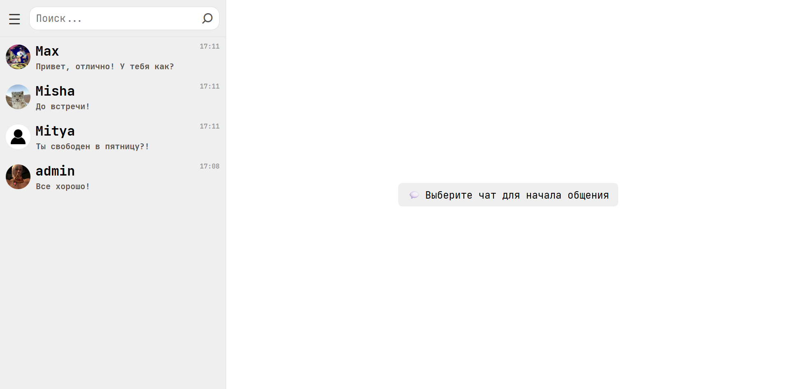
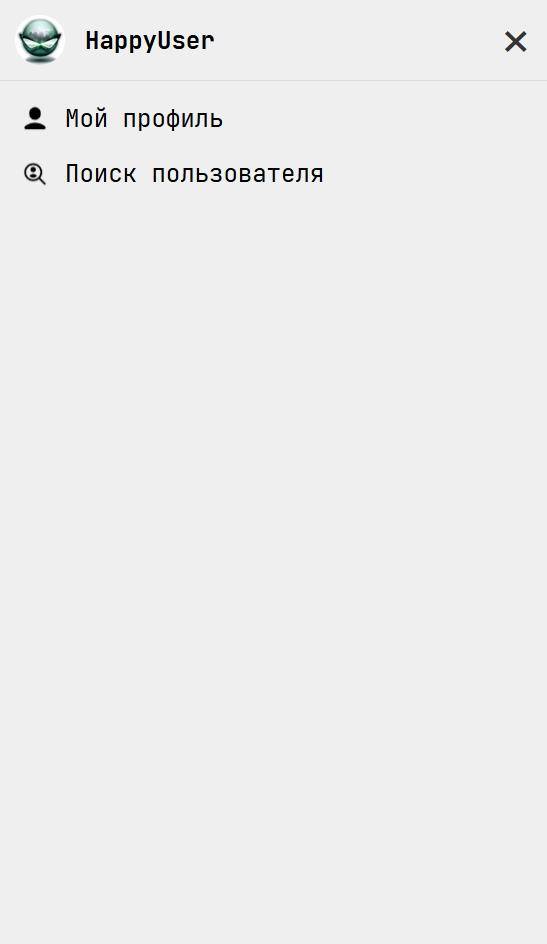
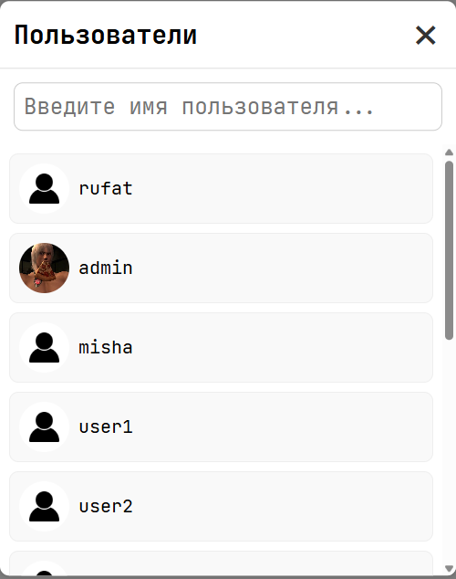
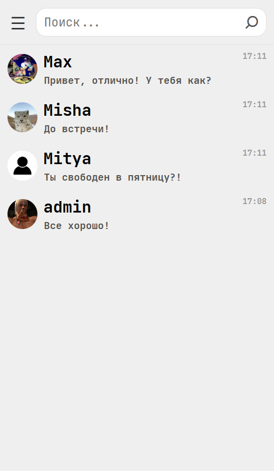
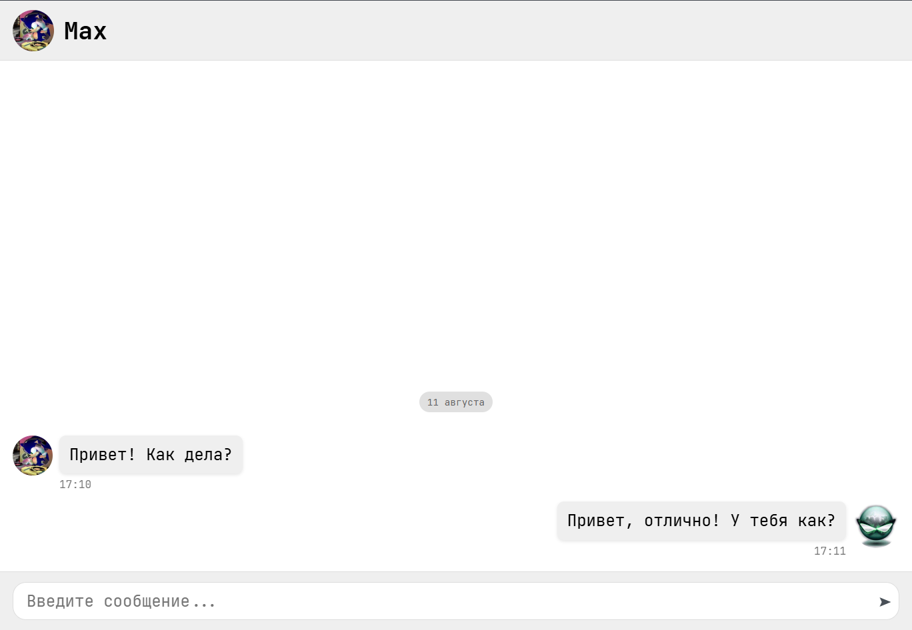
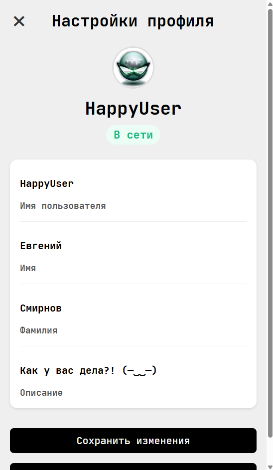

# 💬 FlowChat


**FlowChat** — это современное чат-приложение с реальным временем, построенное на Django + Django REST Framework + Redis + WebSockets.  
Поддерживает личные чаты, авторизацию по токенам, уведомления о новых сообщениях и удобный SPA-интерфейс на чистом JavaScript.

---

## 🚀 Возможности

- 🔐 Авторизация и регистрация с токенами через Djoser
- 💬 Личные чаты между пользователями
- ⚡ Мгновенные сообщения через WebSocket (Django Channels + Redis)
- 📢 Уведомления о новых чатах и сообщениях в реальном времени
- 🖼 Аватары и профили пользователей
- 🔍 Поиск собеседников
- 📱 Одностраничный SPA-интерфейс

## 🖼 Скриншоты

### 📜 Главная страница


### 🧍‍♂️ Меню пользователя (профиль, выход)


### 🔍 Модальное окно поиска пользователей


### 💬 Список чатов (сайдбар с поиском)


### 📨 Окно переписки


### 👤 Профиль пользователя


---

## 🛠 Стек технологий

- **Backend:** Django, Django REST Framework, Djoser, Django Channels, Daphne, Redis
- **Frontend:** JavaScript (SPA), Fetch API
- **База данных:** PostgreSQL / SQLite (в dev)
- **Протоколы:** HTTP + WebSocket
- **Деплой:** любой совместимый сервер с поддержкой ASGI

---

## 📂 Структура проекта
```bash
FlowChat/
├── chat/               # Основное приложение для чатов
│ ├── migrations/       # Автоматически сгенерированные миграции базы данных для модели чата
│ ├── templates/        # HTML-шаблоны, отвечающие за отображение интерфейса чатов
│ │ └── chat/
│ │ └── index.html      # Главная страница с интерфейсом чатов и переписок
│ ├── __init__.py       # Файл для обозначения директории как пакета Python
│ ├── admin.py          # Регистрация моделей приложения в админке Django
│ ├── apps.py           # Конфигурация приложения chat
│ ├── consumers.py      # WebSocket consumer для обработки реального времени (чат-сообщения)
│ ├── routing.py        # Маршруты для WebSocket соединений
│ ├── models.py         # Описание моделей базы данных для чатов, сообщений и т.п.
│ ├── tests.py          # Автоматизированные тесты для приложения chat
│ ├── serializers.py    # Сериализаторы для преобразования моделей в JSON и обратно (DRF)
│ ├── views.py          # View и ViewSet'ы для обработки HTTP-запросов к chat API
│ ├── urls.py           # URL-маршруты для HTTP-запросов приложения chat
│ └── ...               # Дополнительные файлы и ресурсы приложения chat
├── config/             # Основная конфигурация проекта Django
│ ├── init.py           # Пакет конфигурации
│ ├── asgi.py           # ASGI-конфиг для поддержки асинхронных соединений (WebSocket)
│ ├── settings.py       # Главные настройки проекта (база данных, middleware, установленные приложения и т.п.)
│ └── urls.py           # Главные маршруты проекта (включают маршруты приложений)
├── media/              # Папка для хранения загруженных пользователями медиафайлов
│ ├── avatars/          # Аватары пользователей
├── static/             # Папка со статическими файлами (CSS, JS, изображения)
│ ├── chat/             # Статические файлы, относящиеся к приложению chat
│ │ ├── css/
│ │ │ └── styles.css    # Стили для интерфейса чатов
│ │ ├── icons/          # Иконки, используемые в приложении chat
│ │ └── js/
│ │ └── app.js          # Скрипты для фронтенда чатов
├── users/              # Приложение для управления пользователями и профилями
│ ├── migrations/       # Миграции базы данных для моделей пользователей
│ ├── init.py           # Пакет приложения users
│ ├── admin.py          # Регистрация моделей пользователей в админке
│ ├── apps.py           # Конфигурация приложения users
│ ├── models.py         # Модели пользователей, профилей и связанных данных
│ ├── tests.py          # Тесты приложения users
│ ├── views.py          # View и ViewSet'ы для API пользователей
├── manage.py           # Скрипт для запуска и управления проектом (миграции, сервер и т.п.)
├── requirements.txt    # Список зависимостей Python проекта
├── .gitignore          # Файлы и папки, игнорируемые git
└── README.md           # Документация проекта (этот файл)
```

## 📡 API Эндпоинты

> Запросы требуют заголовок авторизации: \
> Authorization: `Token <ваш_токен>` \
> Исключения: регистрация (`/api/users/)` и вход в систему (`/api/login/`) — эти запросы выполняются без токена.

### 🔑 Авторизация

#### 📌 POST `/api/users/` — Регистрация пользователя

```bash
curl -X POST https://example.com/api/users/ \
-H "Content-Type: application/json" \
-d '{"username": "andrew", "password": "Andrew123Password"}'
```

#### Ответ:

```json
{
    "avatar": "/media/avatars/default.jpg",
    "bio": null,
    "first_name": "",
    "id": 16,
    "is_online": false,
    "last_active": null,
    "last_name": "",
    "username": "andrew"
}
```
---

#### 📌 POST `/api/login/` — Вход пользователя

```bash
curl -X POST https://example.com/api/login/ \
-H "Content-Type: application/json" \
-d '{"username": "john_doe", "password": "securepassword"}'
```

#### Ответ:

```json
{
  "id": 1,
  "username": "john_doe",
  "token": "abc123xyz456",
  "detail": "Login successful"
}
```

---

#### 📌 POST `/api/logout/` — Выход пользователя

```bash
curl -X POST https://example.com/api/logout/ \
-H "Authorization: Token abc123xyz456"
```

#### Ответ:

```json
{"detail": "Logged out successfully"}
```

---

### 💬 Чаты

#### 📌 GET `/api/chats/{pk}` — Получить доступные пользователю чаты

```bash
curl -X POST https://example.com/api/chats/{pk}/ \
-H "Authorization: Token abc123xyz456" \
```

#### Ответ:

```json
 {
    "created_at": "2025-08-08T16:17:44.713305Z",
    "display_name": "HappyUser",
    "display_photo": "/media/avatars/coolemotion_MW9LaPx.jpg",
    "display_time": "2025-08-11T14:08:46.388856Z",
    "id": 21,
    "is_group": false,
    "last_message": "Все хорошо!",
    "members": [
        2,
        15
    ],
    "title": null
  }
```

---

#### 📌 GET `/api/chats/` — Получить доступные пользователю чаты

```bash
curl -X POST https://example.com/api/chats/ \
-H "Authorization: Token abc123xyz456" \
```

#### Ответ:

```json
]
    {
        "created_at": "2025-08-06T15:35:31.062606Z",
        "display_name": "Marina",
        "display_photo": "/media/avatars/default.jpg",
        "display_time": "2025-08-06T15:37:13.894669Z",
        "id": 17,
        "is_group": false,
        "last_message": "Как дела?",
        "members": [
            2,
            14
        ],
        "title": null
    },
    {
        "created_at": "2025-08-08T16:17:44.713305Z",
        "display_name": "HappyUser",
        "display_photo": "/media/avatars/coolemotion_MW9LaPx.jpg",
        "display_time": "2025-08-11T14:08:46.388856Z",
        "id": 21,
        "is_group": false,
        "last_message": "Все хорошо!",
        "members": [
            2,
            15
        ],
        "title": null
    }
]

```

---


#### 📌 POST `/api/chats/get_or_create/` — Получить или создать чат

```bash
curl -X POST https://example.com/api/chats/get_or_create/ \
-H "Authorization: Token abc123xyz456" \
-d '{"user_id": "1"}'
```

#### Ответ:

```json
{
    "created_at": "2025-07-16T12:34:20.165197Z",
    "display_name": "rufat",
    "display_photo": "/media/avatars/default_Dmx5yaR.jpg",
    "display_time": "2025-08-07T13:47:46.883584Z",
    "id": 1,
    "is_group": false,
    "last_message": "asd",
    "members": [
        1,
        2
    ],
    "title": "Тест"
}
```

---

#### 📌 GET `/api/chats/{pk}/get_messages/` — История сообщений

```json
]
    {
        "author": {
            "avatar": "/media/avatars/default_Dmx5yaR.jpg",
            "id": 1,
            "username": "rufat"
        },
        "chat": 1,
        "created_at": "2025-08-07T13:39:12.650113Z",
        "edited_at": null,
        "id": 111,
        "is_read": false,
        "text": "Привет!"
    },
    {
        "author": {
            "avatar": "/media/avatars/dante.jpg",
            "id": 2,
            "username": "admin"
        },
        "chat": 1,
        "created_at": "2025-08-07T13:47:46.883584Z",
        "edited_at": null,
        "id": 112,
        "is_read": false,
        "text": "Здравствуй!"
    }
]

```

---

### 👤 Пользователи

#### 📌 PATCH/PUT `/api/users/{pk}/` — Изменение профиля

```bash
curl -X PATCH https://example.com/api/users/{pk}/ \
-H "Authorization: Token abc123xyz456, Content-Type: application/json" \
-d '{"first_name": "CoolBoy"}'
```

#### Ответ:

```json
{
    "avatar": "/media/avatars/dante.jpg",
    "bio": "Я крутой админ!",
    "first_name": "CoolBoy",
    "id": 2,
    "is_online": false,
    "last_active": "2025-08-08T21:58:41.258066Z",
    "last_name": "Фамилия",
    "username": "admin"
}
```

---

#### 📌 GET `/api/users/me/` — Профиль текущего пользователя

```json
{
  "id": 1,
  "username": "john_doe",
  "first_name": "John",
  "is_online": true,
  "last_active": "2025-08-08T12:00:00Z",
  "last_name": "Doe",
  "bio": "Loves coding",
  "avatar": "/media/avatars/john.jpg"
}
```

---

#### 📌 GET `/api/users/{pk}/profile/` — Профиль другого пользователя

```json
{
  "id": 2,
  "username": "alice",
  "first_name": "Alice",
  "is_online": false,
  "last_active": "2025-08-08T10:00:00Z",
  "last_name": "Smith",
  "bio": "Coffee addict",
  "avatar": "/media/avatars/alice.jpg"
}
```
---

#### 📌 GET `api/users/all/` — Список всех пользователей

```json
[
  {
    "id": 1,
    "username": "john_doe",
    "avatar": "/media/avatars/john.jpg"
  },
  {
    "id": 2,
    "username": "alice",
    "avatar": "/media/avatars/alice.jpg"
  }
]
```

---

## 📌 В планах
### ✅ Отправка изображений в чат
### ✅ Индикаторы "печатает..."
### ⏳ Групповые чаты
### ⏳ Push-уведомления в браузере
### ⏳ Тёмная тема

---

## ⚙️ Установка и запуск
```bash
# Клонировать репозиторий
git clone https://github.com/username/flowchat.git
cd flowchat

# Создать и активировать виртуальное окружение
python -m venv venv
source venv/bin/activate   # для Linux/Mac
venv\Scripts\activate      # для Windows

# Установить зависимости
pip install -r requirements.txt

# Выполнить миграции
python manage.py migrate

# Запустить Redis (в отдельном терминале)
redis-server

# Запустить сервер Daphne
daphne -p 8000 flowchat.asgi:application
```

## 🙏 Благодарности
#### UI интерфейс (HTML, CSS, JS) делал [SMLX](https://github.com/jaSmlx)
